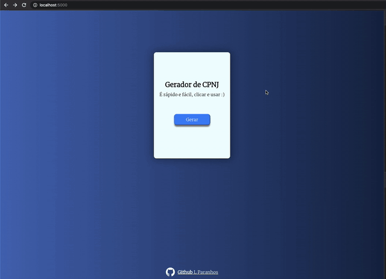

# Gerador de CPNJ

Um gerador simples e prático desenvolvido em Golang

## Como começar

É necessário fazer um clone do projeto.

### Pre-requisitos

Ter o Go instalado

```
https://golang.org/
```

### Rodando o projeto

Rodar o comando abaixo


```
 PORT=5000 ./bin/geradorCnpj 
```
## Visualização


## Autor

* **Leandro Paranhos** - *Dev* - [Github](https://github.com/lParanhos)


## Licença

Este projeto está licenciado sob a licença MIT - consulte o arquivo  [LICENSE.md](LICENSE.md) para obter detalhes
